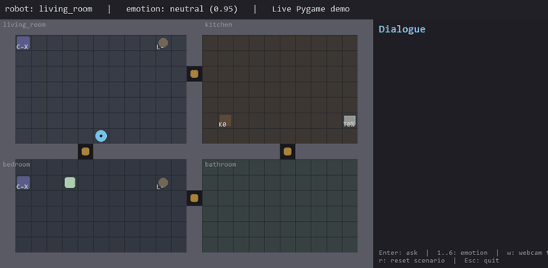

# HomeMate

Simulated home companion robot. MIE1077 (Artificial Intelligence for
Robotics III) course project, University of Toronto, 2026.

The robot lives in a 2D top-down apartment (living room, kitchen, bedroom,
bathroom). It searches for the owner room by room, reads the owner's
facial emotion from the webcam, holds a short empathetic exchange, and
actuates simulated smart-home devices. The pipeline is: OpenCV webcam ->
DeepFace emotion classifier -> Anthropic Claude tool-calling loop -> A*
navigation -> mock IoT.

## Architecture

| Module     | Implementation                                                  |
|------------|-----------------------------------------------------------------|
| Perception | OpenCV webcam capture, DeepFace facial-emotion classifier       |
| Cognition  | Anthropic Claude tool-use loop; deterministic `MockLLM` fallback |
| Planning   | A* on the apartment grid; time-of-day priors for owner search   |
| Action     | 8 primitive skills exposed as JSON tool schemas                 |
| Memory     | Append-only JSONL of episodes + profile rollup in the prompt    |
| UI         | Pygame top-down view, dialogue panel, status bar, input field   |

## Demo



Scenario: the robot starts in the living room, walks to the bedroom to
find a tired owner, then crosses to the kitchen and brews coffee. The
animation is generated headlessly (so it stays in sync with the code):

```powershell
python -m homemate.scripts.gif_demo    # animated GIF
python -m homemate.scripts.snapshot    # single-frame PNG
```

Confirm the Claude API key is wired up (one short call):

```powershell
python -m homemate.scripts.live_check
```

After a few turns, `data/memory/profile.json` looks like:

```json
{
  "total_episodes": 3,
  "emotion_counts": { "sad": 1, "tired": 1, "happy": 1 },
  "device_action_counts": {
    "curtain.bedroom:open": 1,
    "coffee.kitchen:brew": 1
  },
  "recent_requests": [
    "open the bedroom curtains",
    "brew some coffee",
    "thanks for everything"
  ]
}
```

That rollup is summarised into the system prompt on every turn, so Claude
can personalise replies across sessions.

## Setup

Python 3.10 or newer. Python 3.12 is recommended on Windows: at the time
of writing, `pygame`, `tensorflow`, and `deepface` do not yet publish
wheels for 3.14.

```powershell
python -m venv .venv
.\.venv\Scripts\Activate.ps1
pip install -r requirements.txt
copy .env.example .env
```

Then paste your Anthropic API key into `.env`. Get one at
<https://console.anthropic.com/>.

`requirements-minimal.txt` skips DeepFace and TensorFlow. Use it if you
only need the mock emotion path (keys `1`-`6` instead of the real
webcam). DeepFace downloads a few hundred MB of model weights on first
webcam read.

Windows path-length note: TensorFlow ships some deeply nested files. If
you see `OSError [Errno 2]` during install, enable long-path support
once:

```powershell
# elevated PowerShell
Set-ItemProperty -Path "HKLM:\SYSTEM\CurrentControlSet\Control\FileSystem" `
    -Name LongPathsEnabled -Value 1 -Type DWord
```

## Running

```powershell
python -m homemate.main                    # Pygame UI
python -m homemate.demo_cli sad "find me"  # headless one-turn run
python -m pytest tests/ -q                 # smoke + memory tests
```

Pygame key bindings:

| Key      | Action                                                   |
|----------|----------------------------------------------------------|
| `Enter`  | Open input field; press again to send                    |
| `1`-`6`  | Inject a mock emotion (`happy`, `sad`, `angry`, `surprised`, `neutral`, `tired`) |
| `w`      | Toggle the real webcam emotion detector                  |
| `r`      | Reset the scenario (re-randomise the owner location)     |
| `Esc`    | Quit                                                     |

Environment flags:

| Variable                      | Effect                                              |
|-------------------------------|-----------------------------------------------------|
| `ANTHROPIC_API_KEY`           | Required for the real Claude path                   |
| `HOMEMATE_MODEL`              | Defaults to `claude-sonnet-4-6`                     |
| `HOMEMATE_USE_MOCK_LLM=1`     | Use the deterministic mock agent                    |
| `HOMEMATE_USE_MOCK_EMOTION=1` | Skip the webcam, use keyboard-injected emotion      |
| `HOMEMATE_MEMORY_DIR`         | Override the memory directory (default `data/memory/`) |

`demo_cli` also accepts `--no-memory` and `--reset-memory`.

## Layout

```
homemate/
  main.py             Pygame loop and UI
  config.py           Grid, palette, runtime flags
  world/              Apartment, robot/owner entities, mock IoT network
  perception/         Webcam + DeepFace; mock fallback
  planning/           A*; time-of-day room search policy
  cognition/          Claude tool-calling loop; JSON tool schemas
  action/             Primitive skills exposed to the LLM
  memory/             JSONL episode log + profile rollup
  scripts/            live_check.py, snapshot.py, gif_demo.py
tests/
  test_smoke.py       End-to-end MockLLM run
  test_memory.py      Memory module unit tests
```

## Roadmap

| Window          | Phase                                              | Status                                                    |
|-----------------|----------------------------------------------------|-----------------------------------------------------------|
| May 7 - May 28  | 2D simulator, mock IoT, webcam emotion             | done                                                      |
| May 29 - Jun 18 | Claude tool loop, A* navigation, find-and-greet    | done; `live_check` confirms the API path                  |
| Jun 19 - Jul 9  | Memory, ReAct planner, 20-scenario eval suite      | memory done; planner and eval suite in progress           |
| Jul 10 - Jul 30 | Full evaluation, ablations, demo video, slide deck | pending                                                   |
